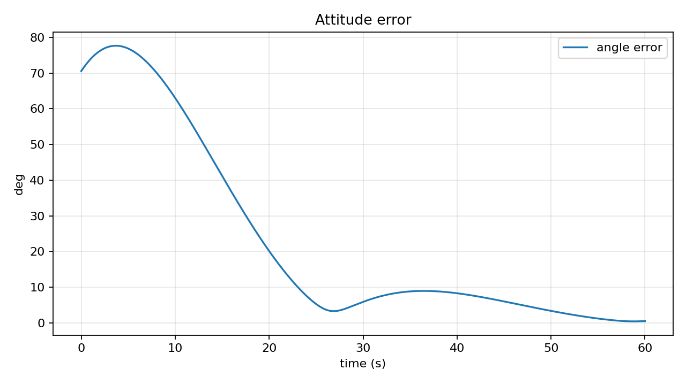
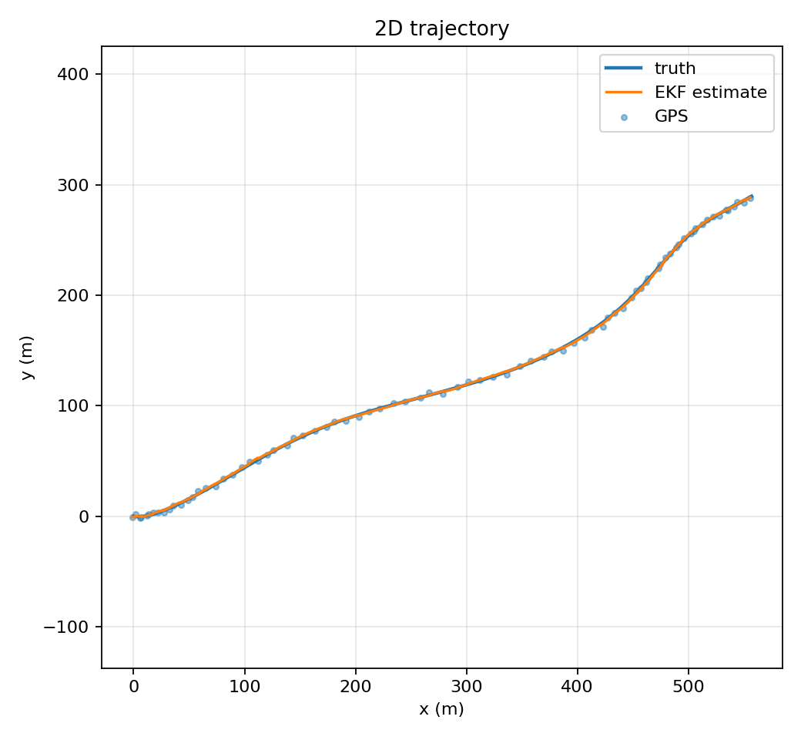
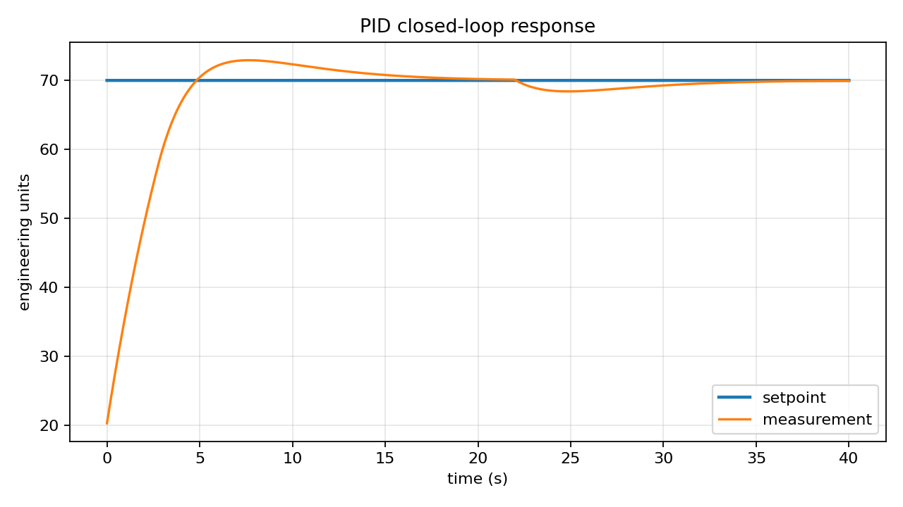

# GNC Projects Every Engineering Student Should Try

This repository contains three from-scratch Guidance, Navigation, and Control projects designed for engineering students:

1. `projects/attitude_control` - 3-axis spacecraft attitude control simulator with PID and LQR-style feedback.
2. `projects/kalman_filter` - Extended Kalman Filter for noisy IMU and GPS sensor fusion.
3. `projects/embedded_controls` - Arduino closed-loop PID controller plus a desktop plant simulation for tuning.

The projects are deterministic and include validation tests so results can be reproduced.

## Quick Start

```powershell
python -m venv .venv
.\.venv\Scripts\Activate.ps1
pip install -r requirements.txt
pytest
python scripts\run_all.py
```

Generated CSV files and plots are written to `results/`.

If `pytest` is not installed yet, you can still run the built-in validation checks:

```powershell
python scripts\validate.py
```

## Expected Validation Results

After running `python scripts\run_all.py`, you should see metrics similar to:

- Attitude controller final attitude error below `1.0 deg`.
- Attitude controller final body-rate norm below `0.02 rad/s`.
- EKF position RMSE below `1.5 m`.
- Embedded PID desktop simulation final tracking error below `1.0 unit`.

Small numerical differences are normal across Python and NumPy versions.

## Results Snapshot

| Project | Metric | Result |
| --- | --- | ---: |
| Attitude Control | Final attitude error | `0.5032 deg` |
| Attitude Control | Final body-rate norm | `0.00361 rad/s` |
| EKF Sensor Fusion | Position RMSE | `0.6911 m` |
| Embedded PID | Final tracking error | `0.0494 units` |
| Embedded PID | Overshoot | `2.9259 units` |

## Visual Results

### Attitude Control



### EKF Sensor Fusion



### Embedded PID Control



## Project Layout

```text
projects/
  attitude_control/
  kalman_filter/
  embedded_controls/
scripts/
tests/
```

Each project folder has its own README with theory, equations, usage, tuning notes, and resume talking points.
