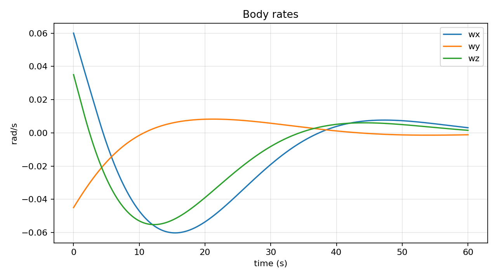

# Project 1: 3-Axis Attitude Control Simulator

## Goal

Build a simulation that stabilizes a rigid spacecraft from an initial tumble to a commanded attitude using feedback control.

## What You Learn

- Quaternion attitude representation.
- Rigid-body rotational dynamics.
- PID and LQR-style state feedback.
- Settling time, rate damping, and control effort tradeoffs.

## Dynamics

The spacecraft is modeled as a rigid body:

```text
J * omega_dot = tau - omega x (J * omega)
q_dot = 0.5 * Omega(omega) * q
```

where:

- `J` is the inertia matrix.
- `omega` is body angular velocity in `rad/s`.
- `tau` is commanded control torque.
- `q` is a scalar-first unit quaternion.

## Run

From the repository root:

```powershell
python -m projects.attitude_control.attitude_sim
```

Outputs:

- `results/attitude/attitude_history.csv`
- `results/attitude/attitude_error.png`
- `results/attitude/body_rates.png`
- `results/attitude/control_torque.png`

## Example Results




## Tuning

Start with higher derivative gain if the vehicle oscillates. Increase proportional gain when response is too slow. Reduce torque limits if you want to model weaker actuators.

## Resume Bullet

Designed a deterministic 3-axis attitude-control simulator in Python using quaternion rigid-body dynamics and PID/LQR-style feedback, validating sub-degree convergence from large initial attitude error.

