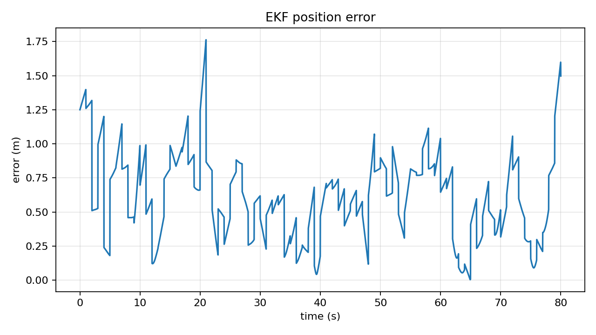

# Project 2: Extended Kalman Filter Sensor Fusion

## Goal

Estimate vehicle state from noisy IMU and GPS data using an Extended Kalman Filter.

## What You Learn

- Nonlinear prediction models.
- Sensor noise, process noise, and measurement covariance.
- IMU dead reckoning drift.
- GPS measurement updates.
- RMSE-based estimator validation.

## State

```text
x = [px, py, vx, vy, yaw, gyro_bias]
```

The IMU provides acceleration and yaw rate. GPS provides lower-rate position and velocity measurements.

## Run

```powershell
python -m projects.kalman_filter.ekf_sensor_fusion
```

Outputs:

- `results/ekf/ekf_history.csv`
- `results/ekf/trajectory.png`
- `results/ekf/position_error.png`
- `results/ekf/yaw_error.png`

## Example Results




## Tuning

Increase process noise if the filter is slow to adapt. Increase measurement noise if GPS updates are causing jumps. A good EKF should beat raw GPS position noise while avoiding IMU-only drift.

## Resume Bullet

Implemented an Extended Kalman Filter for IMU/GPS fusion in Python, estimating 2D position, velocity, yaw, and gyro bias with deterministic simulation and RMSE validation.

